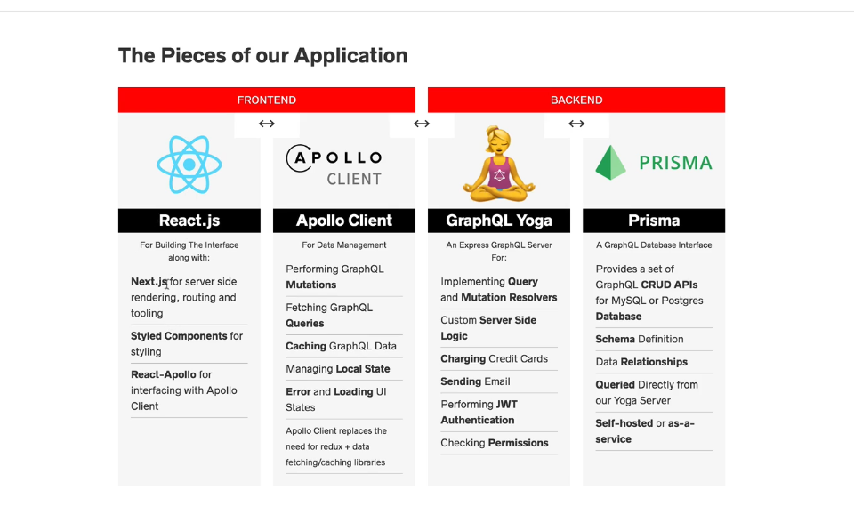

## Sicktree Frontend

Introduction :
--------------

This Project has been created as a follow up on the Fullstack Advanced React & GraphQL Course from [WesBos](https://wesbos.com/). This Particular Course was incredibly helpful in grasping the overall purpose and impact of techs like GraphQL, NextJS and ReactJS. This Project uses GraphQL Prisma and Yoga on the Serverside and Apollo GraphQL, NextJS and ReactJS on the ClientSide, and is similar to the one in the course. I have added Instagram's Server Side Explicit Authentication instead of the one used in the course. This Frontend Project can also be used as boilerplate for projects involving the mentioned tech stack.

Todo :
------

- [ ] Implement Apollo client Side Caching